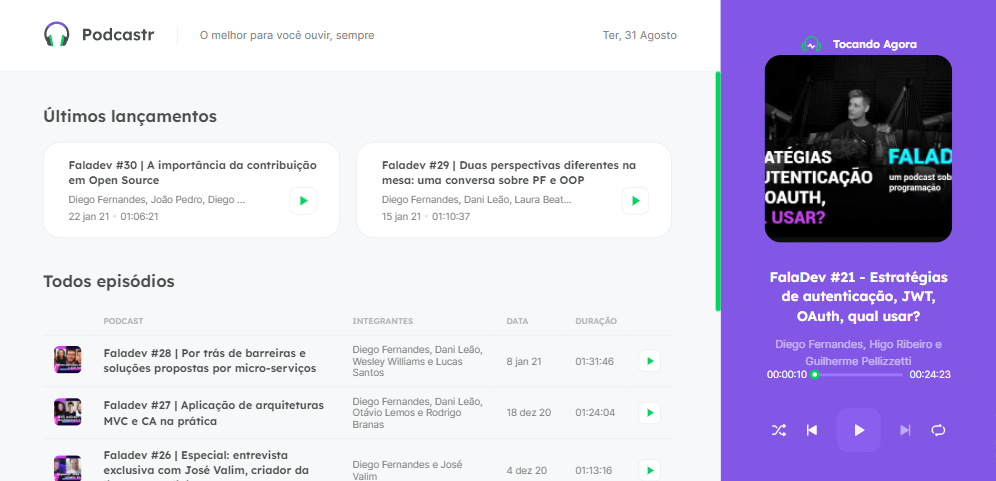

<div align="center">
  <div>
    <h1>Podcastr</h1>
    
    <h3>
      🎧 Aplicação React para exibição e reprodução dos episódios do podcast FalaDev
    </h3>
  </div>

  <p>
    <a href="#-status">Status</a> •
    <a href="#-features">Features</a> • 
    <a href="#%EF%B8%8F-pré-requisitos">Pré-requisitos</a> • 
    <a href="#-tecnologias-utilizadas">Tecnologias utilizadas</a> • 
    <a href="#-autor">Autor</a> •
    <a href="#-readme-versions">README versions</a>
  </p>

  <div>
    
    
    
  </div>
</div>

<hr>

### 🏁 Status

<h3 align="center">
	🎉 Podcastr ✔️ Finalizado 🎉
</h3>

<hr>

### 🏆 Features

- [x] Listar os episódios;
- [x] Acessar página do episódio selecionado;
- [x] Selecionar um episódio para reprodução;
- [x] Exibir o tempo de reprodução atual e a duração do episódio;
- [x] Controlar o tempo de reprodução por meio do componente slider;
- [x] Pausar e reproduzir o episódio selecionado;
- [x] Selecionar, por meio do player, o episódio anterior e o seguinte;
- [x] Habilitar reprodução em loop; e
- [x] Habilitar seleção embaralhada de episódios;

<hr>

### ❗️ Pré-requisitos

Fala Dev, antes de iniciar seus testes e/ou contribuições na aplicação, é necessário ter duas coisas instaladas, a primeira é o nosso maravilhoso [GIT](https://git-scm.com) e a segunda, o [Node.js](https://nodejs.org/en/), além, é claro, de um bom editor de texto.

Bom, tendo tudo isso pronto, podemos ir para o passo a passo de como rodar a aplicação.

### 🕹️ Rodando a aplicação

```bash
# Primeiramente, clone este repositório com o GIT
$ git clone <https://github.com/ThiagoBrito-Dev/Podcastr>

# Acesse a pasta do projeto pelo terminal de comando
$ cd .../Podcastr

# Instale as dependências presentes no package.json
$ yarn / npm install

# Execute o servidor JSON, caso contrário a aplicação não funcionará
$ yarn server

# Execute a aplicação
$ yarn dev

# E, por fim, acesse <http://localhost:3000> para ver a aplicação no servidor local
```

<hr>

### 🔮 Tecnologias utilizadas

- [HTML](https://devdocs.io/html/)
- [Sass](https://sass-lang.com/)
- [TypeScript](https://www.typescriptlang.org/)
- [ReactJS](https://pt-br.reactjs.org/)
- [Next.js](https://nextjs.org/)
- [JSON Server](https://www.npmjs.com/package/json-server)
- [Axios](https://axios-http.com/)
- [date-fns](https://date-fns.org/)
- [rc-slider](https://www.npmjs.com/package//rc-slider)

<hr>

### 👨🏽‍🎓 Autor

<div align="center">
  

  <br />

  <div>
    <h3>
      🤝 Thiago Raniery Brito
    </h3>
    <p>
      E aí Dev, gostou da aplicação? Bom, se quiser, fique à vontade para entrar em contato comigo por aqui ou pelas tags abaixo.
    </p>
  </div>

  <div>
    <a href="https://www.linkedin.com/in/thiagoranierybrito/">
      </a>
    <a href="mailto:thiagobritotrs@gmail.com">
      </a>
  </div>
</div>

<hr>

### 📚 README versions

<div>
  <a href="https://github.com/ThiagoBrito-Dev/Podcastr/blob/main/README.md">Portuguese (pt-br)</a>
  |
  <a href="https://github.com/ThiagoBrito-Dev/Podcastr/blob/main/README-en.md">English (en-us)</a>
</div>
